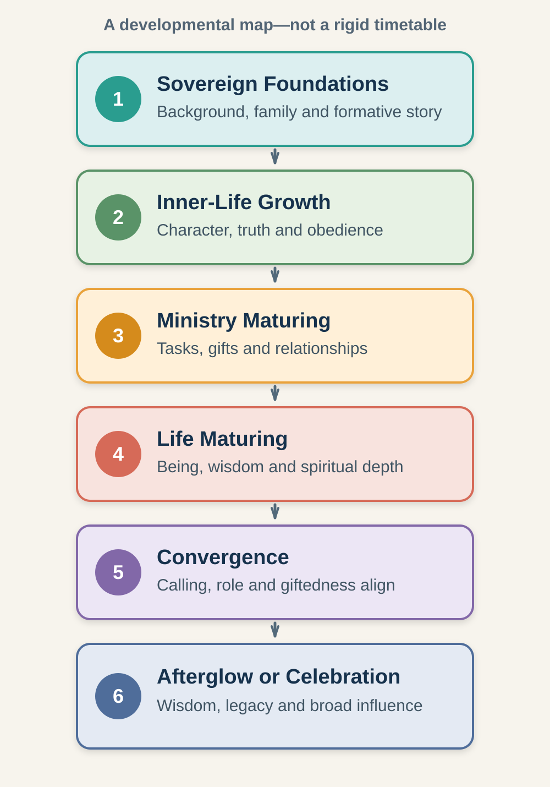
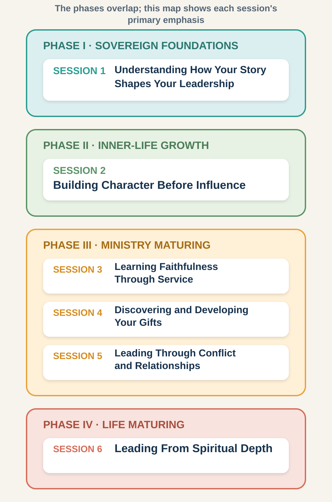

# How God Develops Leaders

**An Interactive Six-Session Journey through Character, Calling, Spiritual Gifts, Ministry, and Maturity**

An interactive course with a separate Facilitator Guide, based on Dr. J. Robert Clinton's leadership development framework.

> **Central principle:** God is not only preparing work for you to do. He is also preparing you for the work he has entrusted to you.

## I.1 Welcome to *How God Develops Leaders*

Leadership development involves more than learning techniques, receiving a title, or becoming more effective. God's deepest work in a leader is the formation of the person behind the leadership.

Before God expands what he does through us, he often deepens what he is doing within us.

Throughout Scripture, God develops leaders over time. He uses their backgrounds, relationships, responsibilities, successes, failures, tests, transitions, and seasons of waiting. Moses spent years in obscurity before leading Israel. David learned faithfulness while caring for sheep before becoming king. Peter was formed through courageous faith, painful failure, restoration, and years of service.

Your leadership story is also still being written.

This course will help you look at your life from a long-term perspective. You will learn to recognise how God may use ordinary responsibilities, significant relationships, spiritual tests, ministry opportunities, conflict, disappointment, and personal growth to form your character and expand your capacity to influence others.

## I.2 What You Will Learn

Across six sessions, you will consider how God develops leaders through:

1. **Your story** — the background and experiences that helped shape you.
2. **Your character** — the inner tests that reveal integrity, obedience, and responsiveness to God's Word.
3. **Your assignments** — the responsibilities through which you learn faithfulness.
4. **Your giftedness** — the natural abilities, acquired skills, and spiritual gifts God has entrusted to you.
5. **Your relationships** — the mentors, authorities, conflicts, and transitions that influence how you lead.
6. **Your maturity** — the movement from simply doing ministry to leading from a deep relationship with God.

## I.3 The Six Phases at a Glance

Dr. J. Robert Clinton describes six broad phases that may appear across the lifetime of a Christian leader.

*Figure 1. The complete six-phase framework. This course concentrates on Phases I–IV.*

### How Your Background Shapes You (Phase I: Sovereign Foundations)

God uses a person's background and early experiences to begin laying foundations for future development. These influences can include family, culture, personality, natural abilities, education, economic circumstances, early responsibilities, relationships, and significant life events.

**Central question:** How has my story helped form the person and leader I am becoming?

### How God Develops Your Inner Life (Phase II: Inner-Life Growth)

God gives particular attention to the leader's relationship with him and to the formation of inner character. Integrity, obedience, responsiveness to Scripture, humility, faithfulness, and spiritual disciplines become important areas of learning.

**Central question:** Who am I becoming when no one is watching?

### Learning Through Active Service (Phase III: Ministry Maturing)

The leader develops through active service. Ministry assignments reveal and shape gifts, skills, values, relational patterns, strengths, limitations, and the leader's use of responsibility and authority.

**Central question:** How is God developing me through the responsibilities I have been given?

### Leading From Spiritual Depth (Phase IV: Life Maturing)

Leadership increasingly flows from spiritual depth, wisdom, character, and an integrated life. God may use success, disappointment, conflict, transition, isolation, loss, and renewed calling to deepen the leader's knowledge of him. The emphasis begins to shift from activity alone toward ministry that flows from being.

**Central question:** Is my leadership flowing from who I am becoming in God?

### When Calling, Gifts, and Role Align (Phase V: Convergence)

A mature leader's calling, character, giftedness, accumulated experience, values, and ministry role increasingly align. The leader becomes more focused on the contribution for which God has especially prepared them.

### Passing On Wisdom and a Spiritual Heritage (Phase VI: Afterglow or Celebration)

Influence increasingly flows from a trusted life, accumulated wisdom, mentoring, prayer, relationships, and a spiritual heritage passed to succeeding generations.

## I.4 What This Course Covers

This curriculum focuses only on the first four phases:

1. How your background shapes you (Phase I: Sovereign Foundations)
2. How God develops your inner life (Phase II: Inner-Life Growth)
3. Learning through active service (Phase III: Ministry Maturing)
4. Leading from spiritual depth (Phase IV: Life Maturing)

These phases address the foundational development most relevant to new and emerging leaders: understanding their story, developing character, learning through ministry assignments, discovering their gifts, navigating relationships, and growing in spiritual maturity.

Participants who wish to learn more about Phase V—**Convergence**—and Phase VI—**Afterglow or Celebration**—may consult Clinton's original work listed under **Source and Further Reading**.

## I.5 Your Six-Session Learning Journey

*Figure 2. The primary phase emphasis of each session. Development is not always linear, and themes may overlap.*

| Session | Primary phase | Main focus | Developmental outcome |
|---|---|---|---|
| 1. Understanding How Your Story Shapes Your Leadership | Phase I (Sovereign Foundations) | Background, formative influences, strengths, vulnerabilities, and commitment | Interpret your story truthfully and redemptively |
| 2. Building Character Before Influence | Phase II (Inner-Life Growth) | Integrity, obedience, Scripture, motives, and response under pressure | Identify a present character-growth priority |
| 3. Learning Faithfulness Through Service | Phase III (Ministry Maturing) | Ministry assignments, faithfulness, learning, and the task continuum | Reframe present responsibilities as developmental opportunities |
| 4. Discovering and Developing Your Gifts | Phase III (Ministry Maturing) | Natural abilities, learned skills, spiritual gifts, practice, and confirmation | Form a provisional giftedness profile and development experiment |
| 5. Leading Through Conflict and Relationships | Phase III (Ministry Maturing) | Authority, submission, conflict, resistance, humility, and accountability | Respond to relational tension without control or avoidance |
| 6. Leading From Spiritual Depth | Phase IV (Life Maturing) | Being and doing, plateaus, spiritual depth, values, and intentional growth | Create a mentor-supported 90-day development plan |

Session 1 gives the participant a language for understanding their roots. Session 2 moves inward to the formation of character. Sessions 3–5 explore three major dimensions of ministry maturing: assignments, giftedness, and relationships. Session 6 introduces the movement toward life maturity and integrates learning from all four phases into a practical plan.

## I.6 How to Prepare and Participate

Each participant session follows an integrated **Learn, Reflect and Apply** rhythm. Teaching and application are arranged together by topic so that you can pause, consider what you have learned, and respond before continuing.

### Learn, Reflect and Apply — Complete Before the Group Meeting

**What you will learn**

- The session's Big Idea
- Why the subject matters
- Important terms from Clinton's framework
- Biblical foundations
- Leadership examples
- Common misunderstandings
- Key principles to remember

**What you will do**

- Complete reflection exercises placed after the teaching they apply to
- Examine your leadership journey
- Apply the concepts to real experiences
- Recognise strengths and vulnerabilities
- Prepare for group discussion
- Identify one practical response

Exercises are marked in two ways:

- **Core exercise:** Complete this before the group meeting. These exercises carry the session's main learning and application.
- **Go Deeper:** Use this optional exercise when you have time or want to explore the subject further.

Every main section also has a stable reference. Introduction sections use references such as **I.3**, while participant sessions use references such as **1.5** or **4.10**. Use these references to find material quickly and to tell the group which section or exercise you want to discuss.

Use the individual study time shown at the beginning of each session as a guide. You may complete a session in one sitting or divide it into shorter periods according to your own schedule. Move through the sections in order and complete the teaching and Core exercises before the group meeting. Some questions are personal; recording a response does not require you to share it publicly.

### The Separate Facilitator Guide and Group Meeting

Facilitators use the separate [Facilitator Guide](07-facilitator-guide.md) to prepare and lead each group meeting. Participants do not need to complete the Facilitator Guide. The group meeting is not intended to repeat the whole teaching section. Its primary purposes are to:

1. Review the most important concepts.
2. Clarify anything participants found difficult.
3. Discuss selected reflection questions.
4. Apply the principles to present leadership situations.
5. Strengthen the participant's next step.
6. Pray and encourage one another.

A group session may take **60–90 minutes**, depending on group size and the depth of discussion. The timing suggestions are flexible.

### After the Group Meeting

Participants complete one practical exercise during the following week. Where possible, they should discuss what they are learning with a trusted mentor, pastor, mature leader, or accountability partner.

## I.7 How to Get the Most From This Course

You will benefit most if you:

- Approach each session prayerfully and honestly.
- Complete the teaching and reflection before the group meeting.
- Participate without comparing your journey with someone else's.
- Share only what you are comfortable sharing.
- Listen respectfully to the experiences of others.
- Complete the practical action at the end of each session.
- Discuss your development with a trusted mentor when possible.
- Remain open to what God may show you over time.

You are not expected to understand your entire life after six sessions. Leadership formation is a lifelong journey. The purpose of this course is to help you notice God's work, respond faithfully, and take your next step.

## I.8 Use the Phases as a Map, Not a Scorecard

The phases are a map, not a rigid timetable.

- They may overlap.
- They are not strictly connected to age.
- Leaders do not all progress at the same rate.
- Character formation continues throughout life.
- A leader may revisit earlier lessons.
- Difficulties do not necessarily mean that someone has failed.
- The phases should never be used to rank leaders or measure personal worth.
- A leader's journey may not fit the framework neatly.

Use the framework to recognise patterns and ask helpful questions—not to diagnose every event or compare yourself with another person.

## I.9 Creating a Safe and Respectful Group

At the beginning of the course, the group should agree that:

1. Personal stories will be treated as confidential.
2. Sharing is voluntary; no one will be pressured to disclose.
3. Participants will listen without rushing to advise or correct.
4. The group will avoid comparing spiritual maturity or leadership potential.
5. People outside the group will be spoken about respectfully.
6. Different personalities and learning styles will be welcomed.
7. Truth, accountability, healing, and appropriate boundaries will be encouraged.
8. The aim is practical obedience, not merely greater knowledge.

## I.10 Healthy Leadership, Safety, and Accountability

The course addresses authority, submission, conflict, spiritual formation, and painful experiences. These themes must be handled carefully.

The material should never be used to suggest that:

- Abuse or wrongdoing was acceptable because God may bring good from it.
- Submission requires unquestioning loyalty to a human leader.
- Criticism of a leader is necessarily rebellion.
- Forgiveness removes the need for safety, boundaries, or accountability.
- A leadership title proves spiritual maturity.
- A facilitator has special authority to determine another person's calling.

Serious ethical, safeguarding, mental-health, or legal concerns require appropriate pastoral, organisational, or professional support. A small-group discussion is not a substitute for those processes.

## I.11 A Prayer for the Journey

> Father, give us wisdom to recognise your work in our lives. Form in us the character of Christ. Teach us to serve faithfully, receive correction humbly, use our gifts for the good of others, and lead from a deep relationship with you. Give us courage for the next step and patience for the lifelong journey. Amen.

## I.12 Source and Further Reading

Clinton, J. Robert. *The Making of a Leader: Recognizing the Lessons and Stages of Leadership Development*. NavPress.

This curriculum summarises and applies selected concepts from Clinton's framework for educational use. Facilitators should consult the original work for fuller treatment of the theory.
