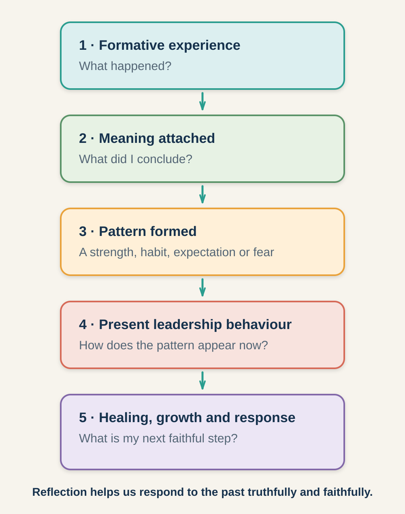

# Session 1: Understanding How Your Story Shapes Your Leadership

**Phase I: Your Background and Defining Commitment to God (Sovereign Foundations and Commitment Boundary)**

**Primary phase:** Phase I (Sovereign Foundations)

> ### Session at a Glance
>
> - **Individual study before the meeting:** 50–75 minutes
> - **Group session:** 60–90 minutes
> - **Practice after the meeting:** One practical exercise during the following week
>
> **Big Idea:** God can use the circumstances and experiences of your life—even those you did not choose—to begin shaping the person and leader you are becoming.

## By the End of This Session

By the end of this session, you should be able to:

- Explain Sovereign Foundations in plain language.
- Identify significant formative influences from your early life.
- Recognise possible strengths and vulnerabilities produced by those influences.
- Describe a commitment or surrender milestone.
- Name one way you can respond to God's continuing work.

---

## Learn, Reflect and Apply

Move through the teaching and exercises in order. Read each section, pause for the related reflection, and record your response before continuing. Some questions are personal; you decide what you are comfortable sharing with the group.

### 1.1 Why This Matters

New leaders often focus on what they lack: experience, knowledge, opportunity, confidence, training, recognised gifts, or a formal position. They may assume that leadership development begins when they receive a title or ministry assignment.

Clinton's framework begins much earlier.

Your family background, culture, personality, education, relationships, responsibilities, difficulties, and opportunities may all have contributed to your formation. Some experiences developed strengths. Others may have produced fears, unhealthy assumptions, or wounds that still require healing. Some may have done both.

Understanding these influences can help you recognise why you respond to people in certain ways, why particular responsibilities energise you, why some situations produce fear or defensiveness, and where growth or healing may be needed.

### 1.2 How Your Background Shapes You (Sovereign Foundations)

**Sovereign Foundations** is Clinton's term for the first broad phase of a leader's development. It includes the people, places, circumstances, opportunities, and experiences that helped form your life before you entered intentional leadership.

These may include:

- Your family of origin
- Your culture and community
- Your economic circumstances
- Your birth order
- Your natural temperament
- Your education
- Early responsibilities
- Significant relationships
- Experiences of acceptance or rejection
- Successes and disappointments
- Exposure to Christian faith and community
- Social or historical events that affected your generation

You did not choose many of these things. Nevertheless, they may have influenced your habits, values, strengths, fears, expectations, and ways of relating to others.

### 1.3 How Formative Experiences Affect Leadership

*Figure 1. Reflection helps a leader recognise the connection between past experience and present behaviour.*

A formative experience does not automatically produce a particular result. Much depends on how it was interpreted, processed, and eventually submitted to God.

For example, someone who carried significant responsibility at a young age may become dependable and resourceful. The same person may also find it difficult to ask for help, trust others, delegate, rest, or admit uncertainty.

The goal of reflection is not to blame the past for present behaviour. It is to identify patterns so that we can respond with truth, responsibility, grace, and appropriate support.

> **Reflect and apply:** Pause here to connect the teaching with your own leadership experience.

### 1.4 What Has Shaped Me?

> **Core exercise 1.4:** Identify the formative influences that have shaped you.

Complete the areas that seem most significant. For each one, note what you experienced, a possible strength, and a possible vulnerability.

**Family and upbringing**

> **Your response:** Experience; possible strength; possible vulnerability.

**Culture and community**

> **Your response:** Experience; possible strength; possible vulnerability.

**School or education**

> **Your response:** Experience; possible strength; possible vulnerability.

**Early responsibilities**

> **Your response:** Experience; possible strength; possible vulnerability.

**Important relationships**

> **Your response:** Experience; possible strength; possible vulnerability.

**Challenges or disappointments**

> **Your response:** Experience; possible strength; possible vulnerability.

**Early experiences of faith**

> **Your response:** Experience; possible strength; possible vulnerability.

### 1.5 Map Your Leadership Story

> **Core exercise 1.5:** Trace significant experiences and what they may have formed in you.

Choose five significant events, relationships, or seasons. For each entry, record the age or season, what happened, how it affected you, and what you are beginning to understand.

1. **Leadership-story entry 1**

   > **Your response:** Age or season; event or influence; effect on you; what you now understand.

2. **Leadership-story entry 2**

   > **Your response:** Age or season; event or influence; effect on you; what you now understand.

3. **Leadership-story entry 3**

   > **Your response:** Age or season; event or influence; effect on you; what you now understand.

4. **Leadership-story entry 4**

   > **Your response:** Age or season; event or influence; effect on you; what you now understand.

5. **Leadership-story entry 5**

   > **Your response:** Age or season; event or influence; effect on you; what you now understand.

Mark each entry with **+** for mainly positive, **–** for mainly painful, **±** for mixed, or **?** if you do not yet understand its significance.

### 1.6 Strengths Can Contain Vulnerabilities

Many leadership strengths have a possible unhealthy expression.

| Developing strength | Possible unhealthy expression |
|---|---|
| Confidence | Dominance or unwillingness to listen |
| Independence | Isolation or resistance to accountability |
| Responsibility | Control or inability to delegate |
| Compassion | Weak boundaries or avoidance of difficult truth |
| Discernment | Suspicion or excessive criticism |
| Courage | Unnecessary confrontation |
| Loyalty | Refusal to recognise harmful behaviour |
| Excellence | Perfectionism or harsh expectations |
| Flexibility | Lack of conviction or direction |
| Decisiveness | Impatience or failure to seek counsel |

Leadership development includes learning to steward strengths with humility and self-awareness. The question is not only, “What am I good at?” It is also, “What happens when this strength is driven by fear, pride, insecurity, or the need for control?”

> **Reflect and apply:** Pause here to connect the teaching with your own leadership experience.

### 1.7 Recognise Your Strengths

> **Core exercise 1.7:** Name strengths that have emerged through your story.

What qualities from your upbringing or early experiences help you serve or lead today?

> **Your response:**
>
> Write your response here.

How have these qualities benefited other people?

> **Your response:**
>
> Write your response here.

### 1.8 Patterns That May Limit My Leadership

> **Core exercise 1.8:** Notice vulnerabilities that may need growth, healing, or accountability.

What fear, assumption, reaction, or habit from your past may limit your leadership if it remains unexamined?

> **Your response:**
>
> Write your response here.

When does this pattern usually appear, and how might it affect other people?

> **Your response:**
>
> Write your response here.

What kind of growth, accountability, healing, or support might help?

> **Your response:**
>
> Write your response here.

### 1.9 Seeing Your Story Through God's Redemptive Work (Sovereign Mindset)

A **sovereign mindset** is the growing ability to view your life with confidence that God is present and able to work redemptively through your story.

It allows you to ask:

- Where was grace present in my story?
- What strengths developed through my experiences?
- What beliefs or wounds still require attention?
- How might God redeem what was painful?
- How can my experiences help me serve others wisely?
- What part of my story do I need to entrust to God?

Joseph demonstrated a redemptive perspective when he told his brothers, “You intended to harm me, but God intended it for good” (Genesis 50:20). Joseph did not deny the wrong that had been done. He recognised both the harmful human intention and God's ability to bring about a redemptive purpose.

#### What This Perspective Does Not Mean

A sovereign mindset does not mean:

- Everything that happened was good.
- God approved another person's wrongdoing.
- Pain should be minimised or ignored.
- You must immediately understand every experience.
- Harmful behaviour should be excused.
- Forgiveness removes the need for safety or accountability.
- You must disclose painful experiences publicly.
- Every difficulty is a direct test from God.

Some experiences require time, pastoral care, counselling, safeguarding action, or other professional support. Mature reflection allows us to name harm truthfully while believing that harm does not have to determine the final meaning of our lives.

### 1.10 Leadership Story: A.W. Tozer — When Unlikely Beginnings Become Foundations

**Source type:** Biographical account

#### The Setting

Aiden Wilson Tozer was born in rural Pennsylvania in 1897. His early environment offered little indication that he would become an influential pastor, writer, and spiritual teacher. His family lived simply, his formal education ended early, and his youth involved manual work rather than theological study.

After his family moved to Akron, Ohio, Tozer worked in an industrial environment. At the age of seventeen, he overheard a street preacher explaining that a person seeking salvation could call upon God. Tozer returned home, went to the family attic, and responded privately to what he had heard.

That simple response became an important commitment boundary. There was no large meeting, recognised mentor, formal programme, or public platform. It was a personal response to God that redirected his life.

#### How the Experience Shaped Him

Several qualities associated with Tozer's early environment later became visible in his ministry:

- Rural solitude may have contributed to his capacity for reflection.
- Limited formal education may have strengthened his habit of independent study.
- Manual work may have helped develop discipline and perseverance.
- Life outside established religious institutions may have contributed to his willingness to question comfortable assumptions.

These qualities were not automatically spiritual virtues. Independence can become isolation. Strong conviction can become harshness. Solitude can make collaboration more difficult. Tozer's strengths still needed to be submitted to God and developed through prayer, Scripture, ministry, and relationships.

As a young minister, Tozer gave sustained attention to prayer, study, and proclamation. Although his formal education had ended early, he became a wide reader and serious student. His later influence did not arise because education was unimportant; it arose because he responded intentionally to the limitations and opportunities within his story. [The official A.W. Tozer biography](https://awtozer.com/life) describes his rural beginnings, conversion in Akron, limited formal education, and lifelong emphasis on prayer, study, and proclamation.

#### What New Leaders Can Learn

Sovereign Foundations does not mean that every feature of a leader's background is positive. It means that background does not have to be dismissed as irrelevant or treated as a permanent limitation.

A new leader can ask:

> What resources, burdens, strengths, and vulnerabilities are already present in my story?

The goal is not to imitate Tozer's personality or ministry style. It is to recognise that God can develop a leader through circumstances that initially appear ordinary, limiting, or disconnected from future service.

#### Reading and Applying This Story Wisely

Do not imply that formal education is unnecessary because Tozer lacked it. His example demonstrates disciplined lifelong learning, not the rejection of training.

Do not suggest that every painful circumstance was directly caused by God. Help participants recognise possible redemptive development without minimising harm.

#### Reflect and Discuss

> **Go Deeper 1.10:** Use these questions for further personal reflection or discussion.

1. Which parts of Tozer's background might initially have appeared to be disadvantages?
2. How did disciplined response turn limitations into developmental resources?
3. Which of Tozer's strengths could also have become vulnerabilities?
4. What apparently ordinary part of your background may be contributing to your leadership?
5. What part of your story still needs healing, training, or surrender?

### 1.11 A Defining Commitment to God (Commitment Boundary)

A **commitment boundary** is a significant point or season in which a person responds to God with a deeper level of faith, surrender, or availability.

For some people, this is their conversion to Christ. For others, it is a later period when they consciously offer their ambitions, career, relationships, abilities, or future to God.

Examples include:

- Receiving Christ and beginning to follow him
- Returning to God after a period of distance
- Responding to a call to serve
- Choosing obedience in a difficult situation
- Surrendering a personal ambition
- Accepting responsibility for the spiritual good of others
- Offering one's career, gifts, or future to God

A commitment boundary does not mean every question has been answered or that the person will never struggle again. There need not be a precise date or dramatic experience. The important question is whether it contributed to a meaningful change in direction, priorities, or obedience.

> **Reflect and apply:** Pause here to connect the teaching with your own leadership experience.

### 1.12 Reflect on Your Defining Commitment to God

> **Core exercise 1.12:** Consider how surrender or commitment to God is shaping your direction.

Was there a significant moment or season when you decided to follow God more fully? What happened?

> **Your response:**
>
> Write your response here.

What changed in your priorities, direction, or behaviour?

> **Your response:**
>
> Write your response here.

What part of your life are you still learning to surrender?

> **Your response:**
>
> Write your response here.

### 1.13 In Summary

1. Leadership formation begins before formal leadership.
2. Early experiences may contribute to both strengths and vulnerabilities.
3. God's redemption does not require us to deny harm.
4. Strengths must be stewarded with humility.
5. A commitment boundary marks a meaningful response to God.
6. Leadership development is a lifelong process.

> **Bring it together:** Review the session, prepare for the group conversation, and identify your next faithful step.

### 1.14 Review What You Learned

> **Go Deeper 1.14:** Use this review if you want to consolidate the session in more detail.

In your own words, what are Sovereign Foundations?

> **Your response:**
>
> Write your response here.

What is a sovereign mindset?

> **Your response:**
>
> Write your response here.

What is a commitment boundary?

> **Your response:**
>
> Write your response here.

### 1.15 Choose What You Will Share

> **Core exercise 1.15:** Prepare one or two responses you are comfortable discussing with the group.

Which section or exercise do you want to refer to during the discussion? For example, **1.5**.

> **Your response:**
>
> Write your response here.

One formative influence I am willing to discuss:

> **Your response:**
>
> Write your response here.

One strength or vulnerability I am willing to discuss:

> **Your response:**
>
> Write your response here.

One question I would like to ask:

> **Your response:**
>
> Write your response here.

### 1.16 Choose One Next Step

> **Core exercise 1.16:** Turn one insight into a specific and realistic response.

> In response to this session, I will:

> **Your response:**
>
> Write your response here.

**How I will do this**

> **Your response:**
>
> Write your response here.

**A person who can support me**

> **Your response:**
>
> Write your response here.

### 1.17 Between Sessions: Ask and Listen

Speak with someone who has known you for several years. Ask:

1. What strengths have you consistently seen in me?
2. What experiences appear to have shaped those strengths?
3. What leadership vulnerability should I become more aware of?
4. Where have you seen evidence of God's work in my life?

Listen without immediately explaining or defending yourself.

#### Record What You Heard

> **Your response:**
>
> Write your response here.

#### Identify What You Want to Explore Further

> **Your response:**
>
> Write your response here.
