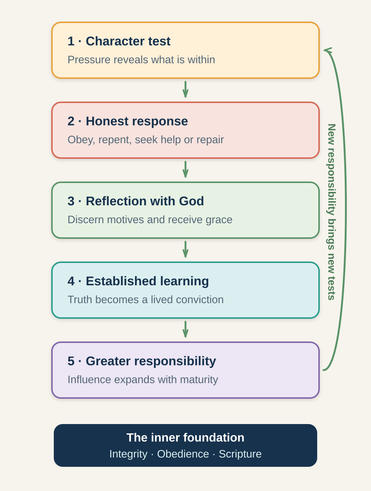

# Session 2: Building Character Before Influence

**Phase II: Integrity, Obedience, and Living by Scripture (Inner-Life Growth and Character Checks)**

**Primary phase:** Phase II (Inner-Life Growth)

> ### Session at a Glance
>
> - **Individual study before the meeting:** 50–75 minutes
> - **Group session:** 60–90 minutes
> - **Practice after the meeting:** One practical exercise during the following week
>
> **Big Idea:** Before God entrusts wider influence to a leader, he gives attention to the leader's inner life—motives, integrity, obedience, and responsiveness to truth.

## By the End of This Session

By the end of this session, you should be able to:

- Explain why character is foundational to Christian leadership.
- Distinguish integrity, obedience, and Word checks.
- Reflect on how you respond when obedience is costly.
- Identify one present character-growth priority.
- Choose a practical response involving obedience, repair, or accountability.

---

## Learn, Reflect and Apply

Move through the teaching and exercises in order. Read each section, pause for the related reflection, and record your response before continuing. Some questions are personal; you decide what you are comfortable sharing with the group.

### 2.1 Why This Matters

Leadership creates pressure. Pressure does not normally create character from nothing; it reveals patterns that are already present.

A person may be gifted, persuasive, energetic, or visionary and still be unprepared for the weight of influence. Skills can attract attention, but character determines whether influence can be carried safely and faithfully.

During Inner-Life Growth, God's work **in** the leader is often more important than visible ministry results. Early opportunities, delays, disappointments, temptations, correction, and ordinary responsibilities may expose the leader's motives and deepen trust in God.

### 2.2 How God Develops Your Inner Life (Inner-Life Growth)

**Inner-Life Growth** describes a season in which God gives particular attention to the leader's relationship with him and to the formation of character.

This can include learning to:

- Live consistently when no one is watching
- Recognise and obey God's direction
- Receive correction without defensiveness
- Let Scripture shape priorities and behaviour
- Confess wrongdoing and make appropriate repair
- Practise spiritual disciplines without performing for others
- Depend on grace rather than image or achievement

Inner-Life Growth is not limited to one age or period. Mature leaders continue to face character tests throughout life.

### 2.3 Three Ways Character Is Tested (Character Checks)

Clinton's framework identifies recurring experiences that test and strengthen a leader's character. This course concentrates on three.

#### 1. Integrity Under Pressure (Integrity Check)

An **integrity check** reveals whether a leader's behaviour is consistent with their stated convictions.

It may involve:

- Honesty when deception would be convenient
- Purity when temptation is private
- Stewardship of money or resources
- Keeping a promise when it becomes costly
- Giving credit to others
- Telling the truth about a mistake
- Refusing to manipulate information or people

Integrity is more than avoiding scandal. It is the growing wholeness in which beliefs, motives, words, and actions increasingly agree.

#### 2. Obedience When It Costs You (Obedience Check)

An **obedience check** occurs when a leader recognises a clear responsibility but finds the response costly, uncomfortable, or inconvenient.

It may involve:

- Apologising
- Ending an unhealthy practice
- Waiting rather than forcing an opportunity
- Speaking truth respectfully
- Serving without recognition
- Seeking help
- Following a legitimate instruction one would not have chosen

Obedience does not mean following every human demand. Christian obedience is first directed to God and must be consistent with Scripture, truth, love, and appropriate accountability.

#### 3. Letting Scripture Examine You (Word Check)

A **Word check** concerns a leader's willingness to receive, understand, and personally apply truth from Scripture before using it to instruct others.

It asks:

- Do I approach Scripture to be formed or merely to prepare material?
- Will I obey a truth that challenges my preferences?
- Do I use verses to control others while ignoring their application to me?
- Can I admit when my interpretation needs correction?
- Is the Word shaping my values, habits, relationships, and ambitions?

Leaders must not teach others to live under truths they refuse to practise themselves.

> **Reflect and apply:** Pause here to connect the teaching with your own leadership experience.

### 2.4 Review Your Integrity

> **Core exercise 2.4:** Examine one present area where integrity matters.

Rate each area from 1 to 5, where 1 means “needs urgent attention” and 5 means “generally consistent.” This is for private reflection.

| Area | Rating | Evidence or concern |
|---|---:|---|
| Honesty in communication |  |  |
| Handling money and resources |  |  |
| Keeping promises |  |  |
| Giving credit to others |  |  |
| Sexual and relational boundaries |  |  |
| Admitting mistakes |  |  |
| Consistency between public and private life |  |  |

Which area most needs attention?

> **Your response:**
>
> Write your response here.

### 2.5 Where Is Obedience Costly?

> **Core exercise 2.5:** Identify one situation in which faithful obedience carries a cost.

Is there a responsibility you already recognise but have delayed?

> **Your response:**
>
> Write your response here.

What makes obedience difficult?

> **Your response:**
>
> Write your response here.

What wise, safe, and concrete step can you take?

> **Your response:**
>
> Write your response here.

### 2.6 What Is Scripture Asking of You?

> **Core exercise 2.6:** Let a specific passage of Scripture examine your response.

What passage of Scripture has recently challenged your attitude, ambition, relationship, or behaviour?

> **Your response:**
>
> Write your response here.

What would it look like to apply that truth before teaching it to someone else?

> **Your response:**
>
> Write your response here.

### 2.7 How Pressure Can Produce Growth (Testing and Growth Cycle)

*Figure 1. A constructive response to testing can establish learning and prepare a leader for greater responsibility.*

A character test is not a pass–fail examination that determines a person's worth. When a leader responds poorly, grace makes repentance, repair, learning, and renewed obedience possible.

Growth often includes:

1. Pressure reveals a motive, belief, or behaviour.
2. The leader reflects honestly before God.
3. The leader obeys, repents, seeks help, or repairs harm.
4. Truth becomes a lived conviction.
5. The leader becomes better prepared for responsibility.
6. New situations test the learning at a deeper level.

Repeated failure should not be hidden behind spiritual language. It may require stronger accountability, removal from responsibility, restitution, counselling, safeguarding action, or a sustained period of rebuilding trust.

> **Reflect and apply:** Pause here to connect the teaching with your own leadership experience.

### 2.8 Reflect on Your Response Under Pressure

> **Core exercise 2.8:** Notice what pressure is currently revealing and forming in you.

Think of a recent situation that placed you under pressure.

What happened?

> **Your response:**
>
> Write your response here.

What did the situation reveal about your motives, fears, or habits?

> **Your response:**
>
> Write your response here.

How did you respond?

> **Your response:**
>
> Write your response here.

What might a more faithful response look like now?

> **Your response:**
>
> Write your response here.

### 2.9 Biblical Examples

#### Daniel: Integrity under Pressure

Daniel and his friends had to decide how to remain faithful within an unfamiliar and powerful culture (Daniel 1). Their response combined conviction, respect, wisdom, and courage. They did not use faithfulness as an excuse for hostility, nor did they surrender conviction for acceptance.

#### Abraham: Obedience and Trust

Abraham's life contains repeated calls to trust God without seeing the entire outcome. His story also shows that faith develops over time and that even significant leaders can respond inconsistently. Leadership development is a journey of learning dependence, not performing perfection.

#### Samuel: Receiving and Speaking a Difficult Word

As a young person, Samuel received a difficult message concerning Eli's household (1 Samuel 3). He had to listen accurately and speak truth without arrogance. A Word check involves both receiving truth personally and handling it responsibly.

### 2.10 Leadership Story: Amy Carmichael — When the Word Reorders a Leader's Values

**Source type:** Biographical account

#### The Setting

Amy Carmichael was born in County Down, Ireland, in 1867 and grew up in a devout Christian family. As a young woman living near Belfast, she occupied a respectable position within church and society.

In 1885, Carmichael and her brothers encountered a poor woman struggling under a heavy load as they walked home from church. They stopped to help her. Although the action was compassionate, Carmichael became painfully aware of respectable churchgoers watching them.

She wanted to help the woman, but she also felt embarrassed to be seen with her.

As they passed a fountain, words from 1 Corinthians 3 concerning work that would endure came forcefully to Carmichael's mind. Clinton uses this experience as a **Word check**: Scripture confronted not only her behaviour but also the values beneath it.

The visible action was good—she was helping someone in need—but the incident exposed a conflict between compassion and the desire for social approval.

#### The Turning Point

A Word check becomes significant when biblical truth moves beyond a passing emotional response and begins to shape continuing decisions.

Carmichael's concern for work of eternal worth became increasingly visible. She later served working-class mill girls in Belfast, pursued missionary service, and arrived in India in 1895. Her ministry eventually concentrated on caring for vulnerable children through the Dohnavur Fellowship. Her service in India continued for the remainder of her life. Biographical summaries connect her ministry with deep reliance on Scripture, prayer, holiness, and practical care for vulnerable people. [Boston University's History of Missiology](https://www.bu.edu/missiology/missionary-biography/c-d/carmichael-amy-beatrice-1867-1951/) provides an overview of this longer ministry.

The Belfast incident should not be presented as though one verse instantly produced her entire calling. It was one formative moment within a longer process involving family influence, bereavement, work among the poor, Christian community, health limitations, missionary preparation, and years of service.

#### What New Leaders Can Learn

A Word check asks more than:

> Do I understand this passage?

It asks:

> What motive, ambition, fear, habit, or priority must come under the authority of this truth?

Scripture may affirm a leader, but it may also confront the need for approval, recognition, control, comfort, or success.

A leader has not fully received a truth merely because they can explain or teach it. The truth must first be allowed to examine and form the leader.

#### Reading and Applying This Story Wisely

Do not encourage participants to treat every thought or strong impression as a direct word from God. Impressions should be examined through Scripture in context, mature counsel, character, and responsible application.

Avoid promising that obedience will produce immediate visible success. Biographical stories should illustrate principles, not become formulas.

#### Reflect and Discuss

> **Go Deeper 2.10:** Use these questions for further personal reflection or discussion.

1. What competing values were revealed in Carmichael's response?
2. Why can a good outward action still become a character test?
3. How did one encounter with Scripture develop into a continuing conviction?
4. What passage is currently challenging one of your priorities?
5. What practical action would demonstrate that you have received that truth personally?

### 2.11 Four Questions to Ask During a Character Test

When you face pressure, ask:

1. **What is being revealed?** Identify the motive, fear, desire, or behaviour beneath the situation.
2. **What truth applies?** Consider Scripture in context and seek wise counsel.
3. **What response is faithful?** This may include action, waiting, confession, repair, boundaries, or asking for help.
4. **Who should walk with me?** Choose appropriate accountability rather than secrecy.

> **Reflect and apply:** Pause here to connect the teaching with your own leadership experience.

### 2.12 Repair and Accountability

> **Core exercise 2.12:** Identify any repair, support, or accountability needed for your next step.

Do you need to confess wrongdoing, correct inaccurate information, return something, apologise, or repair harm?

> **Your response:**
>
> Write your response here.

Who can help you respond wisely and safely?

> **Your response:**
>
> Write your response here.

> For serious misconduct, abuse, safeguarding concerns, or illegal activity, do not rely only on personal confession. Follow the appropriate reporting and accountability processes.

### 2.13 In Summary

1. Giftedness cannot substitute for character.
2. Pressure reveals patterns that need attention.
3. Integrity aligns convictions, words, motives, and behaviour.
4. Obedience to God never excuses abuse, manipulation, or illegality.
5. Scripture must shape the leader before it becomes material for others.
6. Failure can become a place of repentance and growth, but trust may take time to rebuild.

> **Bring it together:** Review the session, prepare for the group conversation, and identify your next faithful step.

### 2.14 Review What You Learned

> **Go Deeper 2.14:** Use this review if you want to consolidate the session in more detail.

How would you explain Inner-Life Growth to a new leader?

> **Your response:**
>
> Write your response here.

What distinguishes an integrity check, obedience check, and Word check?

> **Your response:**
>
> Write your response here.

### 2.15 Choose What You Will Share

> **Core exercise 2.15:** Prepare one or two responses you are comfortable discussing with the group.

Which section or exercise do you want to refer to during the discussion? For example, **2.8**.

> **Your response:**
>
> Write your response here.

One principle I am willing to discuss:

> **Your response:**
>
> Write your response here.

One present growth area I am willing to name:

> **Your response:**
>
> Write your response here.

One question I have:

> **Your response:**
>
> Write your response here.

### 2.16 Choose One Next Step

> **Core exercise 2.16:** Choose a specific response involving obedience, repair, or accountability.

Choose one:

- Complete one delayed act of obedience.
- Make an appropriate apology or repair.
- Ask a mentor to help you establish accountability.
- Practise one passage of Scripture for seven days.
- Tell the truth about one mistake you have been hiding.

**My action**

> **Your response:**
>
> Write your response here.

**My target completion date**

> **Your response:**
>
> Write your response here.

### 2.17 Between Sessions: Practise a Daily Integrity Review

At the end of each day, spend five minutes asking:

1. Where did my actions agree with my convictions today?
2. Where did fear, pride, approval, or convenience influence me?
3. Is there something I need to confess, correct, or repair?
4. What grace and help do I need for tomorrow?

Record one repeated pattern you notice.

> **Your response:**
>
> Write your response here.
