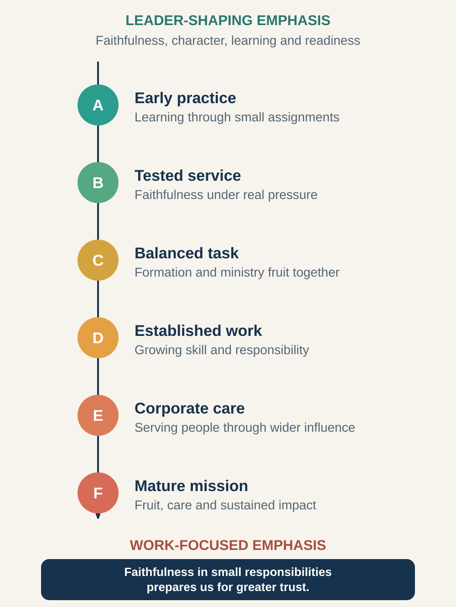

# Session 3: Learning Faithfulness Through Service

**Phase III: How Ministry Assignments Develop a Leader (Ministry Maturing and Ministry Task Continuum)**

**Primary phase:** Phase III (Ministry Maturing)

> ### Session at a Glance
>
> - **Individual study before the meeting:** 50–75 minutes
> - **Group session:** 60–90 minutes
> - **Practice after the meeting:** One practical exercise during the following week
>
> **Big Idea:** God uses ministry assignments not only to accomplish work through us, but also to shape faithfulness, skill, wisdom, and readiness within us.

## By the End of This Session

By the end of this session, you should be able to:

- Explain how ministry assignments can develop a leader.
- Place current responsibilities along the ministry task continuum.
- Apply the Luke 16:10 little–big principle.
- Identify what a present assignment may be teaching you.
- Choose one way to serve more faithfully without confusing faithfulness with unhealthy overwork.

---

## Learn, Reflect and Apply

Move through the teaching and exercises in order. Read each section, pause for the related reflection, and record your response before continuing. Some questions are personal; you decide what you are comfortable sharing with the group.

### 3.1 Learning Through Active Service (Ministry Maturing)

During **Ministry Maturing**, a leader learns through active service. Responsibilities become a practical classroom in which gifts, skills, character, relationships, authority, and limitations are revealed.

New leaders may evaluate an assignment only by its visibility or apparent importance. They may ask:

- Is this a significant role?
- Will anyone notice my contribution?
- Does this use my best gifts?
- Will it lead to greater opportunity?

Clinton's framework encourages another set of questions:

- What can I learn here?
- Who can I serve?
- What does this responsibility reveal about me?
- What skill or character quality is being developed?
- What would faithfulness look like in this season?

### 3.2 Every Assignment Can Develop You (Ministry Task)

A **ministry task** is a definable assignment involving responsibility, action, accountability, and some form of evaluation.

Examples include:

- Leading a small-group discussion
- Following up a new believer
- Organising a ministry event
- Preparing a teaching
- Coordinating volunteers
- Caring for someone in difficulty
- Managing money or resources
- Serving on a team
- Starting or completing a project

Not every task must be dramatic or formally assigned. Repeated ordinary responsibilities may be among the most important developmental experiences in a new leader's life.

### 3.3 How Different Assignments Develop Leaders (Ministry Task Continuum)

*Figure 1. Some assignments primarily develop the leader; others place greater emphasis on accomplishing ministry through a more developed leader.*

Clinton describes a continuum of ministry tasks. Early assignments often give particular emphasis to shaping the leader. With maturity, assignments may carry greater responsibility for accomplishing work, caring for people, building teams, or producing lasting fruit.

The distinction is not absolute. A task can serve people and form the leader at the same time.

#### Tasks A and B: Early Practice and Testing

These are often limited assignments through which a leader learns obedience, courage, dependence, and basic ministry skills. Jesus sending the Twelve in Luke 9 and the larger group in Luke 10 provides a biblical picture of disciples learning through real participation.

#### Task C: A Balanced Assignment

The task meaningfully serves others while also testing discernment and readiness. Barnabas being sent to observe and encourage the work in Antioch (Acts 11:22–24) illustrates trusted service requiring spiritual perception and mature response.

#### Tasks D, E, and F: Established Responsibility

These assignments carry increasing focus on accomplishing ministry, shepherding people, building work, strengthening churches, or representing a team. Paul and Barnabas's mission in Acts 13 and the trusted responsibilities given to Timothy and Epaphroditus in Philippians 2 illustrate mature service.

The letters do not provide a ranking system for personal worth. They describe the changing developmental emphasis of assignments.

> **Reflect and apply:** Pause here to connect the teaching with your own leadership experience.

### 3.4 Review Your Current Responsibilities

> **Core exercise 3.4:** Identify what your present responsibilities may be developing in you.

List up to four regular responsibilities in church, work, family, or community. For each one, identify who is served, whether its main emphasis is leader-shaping, balanced, or work-focused, and what you may be learning.

1. **Responsibility 1**

   > **Your response:** Responsibility; who is served; developmental emphasis; what you may be learning.

2. **Responsibility 2**

   > **Your response:** Responsibility; who is served; developmental emphasis; what you may be learning.

3. **Responsibility 3**

   > **Your response:** Responsibility; who is served; developmental emphasis; what you may be learning.

4. **Responsibility 4**

   > **Your response:** Responsibility; who is served; developmental emphasis; what you may be learning.

Which responsibility do you tend to undervalue?

> **Your response:**
>
> Write your response here.

Why?

> **Your response:**
>
> Write your response here.

### 3.5 Why Small Responsibilities Matter (Little–Big Principle)

Jesus teaches in Luke 16:10 that faithfulness in little is connected with faithfulness in much.

For new leaders, a “little” responsibility may include:

- Arriving prepared and on time
- Following through on a promise
- Caring for one overlooked person
- Handling confidential information wisely
- Cleaning up after an event
- Completing an administrative task accurately
- Communicating early when a commitment cannot be met
- Supporting another person's leadership

Faithfulness does not guarantee promotion. It prepares the leader to carry responsibility well, whether or not that responsibility becomes more visible.

> **Reflect and apply:** Pause here to connect the teaching with your own leadership experience.

### 3.6 How Faithful Are You in Small Responsibilities?

> **Core exercise 3.6:** Examine how you approach ordinary or less visible responsibilities.

Think of a small, routine, or unnoticed responsibility.

What would excellent faithfulness look like?

> **Your response:**
>
> Write your response here.

What usually prevents you from doing it well?

> **Your response:**
>
> Write your response here.

What one improvement can you make this week?

> **Your response:**
>
> Write your response here.

### 3.7 Faithfulness Is Not Overwork

The little–big principle can be misused. Faithfulness does not mean:

- Saying yes to every request
- Accepting unsafe or unethical instructions
- Ignoring family, health, rest, or other responsibilities
- Remaining indefinitely in an exploitative role
- Hiding capacity limits
- Refusing to ask for help
- Measuring spirituality by exhaustion

A faithful leader communicates clearly, establishes appropriate boundaries, and serves within genuine commitments. Reliability includes saying no honestly when necessary.

> **Reflect and apply:** Pause here to connect the teaching with your own leadership experience.

### 3.8 Capacity and Boundaries

> **Core exercise 3.8:** Consider whether your current commitments are faithful and sustainable.

Where might you be confusing faithfulness with overcommitment?

> **Your response:**
>
> Write your response here.

What boundary, conversation, or request for help is needed?

> **Your response:**
>
> Write your response here.

### 3.9 Learning through Evaluation

An assignment becomes more developmental when the leader reflects on it.

After a task, ask:

1. What was I responsible for?
2. Who was served?
3. What went well?
4. What did not go well?
5. What did the experience reveal about my character or skill?
6. What feedback did I receive?
7. What will I do differently next time?

Evaluation is not condemnation. It turns experience into learning.

> **Reflect and apply:** Pause here to connect the teaching with your own leadership experience.

### 3.10 Learn From a Recent Assignment

> **Core exercise 3.10:** Review one assignment for evidence, feedback, and learning.

Choose one recent ministry assignment.

What was your responsibility?

> **Your response:**
>
> Write your response here.

What went well?

> **Your response:**
>
> Write your response here.

What did not go well?

> **Your response:**
>
> Write your response here.

What did it reveal about your character, gifts, skills, or relationships?

> **Your response:**
>
> Write your response here.

What feedback do you need?

> **Your response:**
>
> Write your response here.

### 3.11 Leadership Story: Dawson Trotman — When Disappointing Results Redefine the Work

**Source type:** Organisational history

#### The Setting

Dawson Trotman began his ministry with a strong desire to introduce people to Christ. He spoke enthusiastically with people he encountered and saw individuals make professions of faith.

At first, visible response could easily be interpreted as ministry success.

A disturbing encounter forced him to reconsider that assumption. Trotman picked up a hitchhiker whom he had previously led to make a Christian commitment. He found little evidence of continuing spiritual growth.

The experience raised a difficult question:

> Was obtaining an initial response enough, or did Christian ministry require sustained follow-up and formation?

According to The Navigators' organisational history, this disappointment contributed to Trotman's growing conviction that new believers needed to be established in their faith. His ministry began moving from an emphasis on breadth toward greater depth. [The Navigators' history](https://history.navigators.org/a-history-of-our-calling/) describes this movement from evangelistic response to follow-up, deeper investment, and reproducible discipleship.

#### What Changed

Trotman did not simply abandon evangelism. He changed his understanding of what the assignment required.

He began investing deeply in a smaller number of people. Scripture memory, prayer, Bible study, personal obedience, and the ability to help another believer became important parts of the developing approach.

This principle became particularly visible in Trotman's relationship with sailor Les Spencer. After being helped by Trotman, Spencer brought another person and expected Trotman to teach him. Trotman instead directed Spencer to pass on what he had learned. The aim was no longer only a growing number of followers around one gifted leader. The aim was disciples who could help form other disciples. [NavPress's account of Trotman](https://www.navpress.com/dawson-trotman) connects this development with the multiplying pattern of 2 Timothy 2:2.

The ministry task had matured:

- From obtaining decisions to developing disciples
- From brief contact to sustained investment
- From personal addition to spiritual multiplication
- From doing all the ministry himself to equipping others

#### What New Leaders Can Learn

A disappointment can become a developmental pivot when a leader is willing to examine results honestly.

The correct response is not always to work harder. Sometimes the leader must reconsider:

- What outcome are we actually seeking?
- What assumptions shaped the present method?
- Are people being formed, or merely counted?
- What part of the task have we neglected?
- What must change in our definition of faithfulness?

Trotman's experience illustrates how an early ministry assignment can shape the leader while also improving the work.

#### Reading and Applying This Story Wisely

Do not suggest that every disappointing result requires an immediate strategic change. Leaders should gather evidence, seek counsel, pray, and test adjustments.

Do not imply that a leader is personally responsible for controlling another person's spiritual growth.

#### Reflect and Discuss

> **Go Deeper 3.11:** Use these questions for further personal reflection or discussion.

1. What assumption about ministry success did the hitchhiker encounter expose?
2. How did Trotman's disappointment change the design of his ministry?
3. What is the difference between completing an activity and accomplishing its deeper purpose?
4. What present assignment may be teaching you something about your methods?
5. Where might you need to move from doing the work yourself to equipping another person?

> **Reflect and apply:** Pause here to connect the teaching with your own leadership experience.

### 3.12 What Can a Disappointment Teach You?

> **Go Deeper 3.12:** Explore what a disappointing result may be teaching you about the work.

Describe a disappointment that may contain a ministry lesson.

> **Your response:**
>
> Write your response here.

What assumption might need to change?

> **Your response:**
>
> Write your response here.

What should you test before changing direction?

> **Your response:**
>
> Write your response here.

### 3.13 In Summary

1. Ministry assignments accomplish work and develop the leader.
2. Small responsibilities can reveal readiness for greater trust.
3. Visibility is not a reliable measure of developmental importance.
4. Evaluation turns experience into learning.
5. Faithfulness includes boundaries, communication, and sustainable service.
6. Disappointment can become a ministry-learning opportunity.

> **Bring it together:** Review the session, prepare for the group conversation, and identify your next faithful step.

### 3.14 Choose What You Will Share

> **Core exercise 3.14:** Prepare one or two responses you are comfortable discussing with the group.

Which section or exercise do you want to refer to during the discussion? For example, **3.10**.

> **Your response:**
>
> Write your response here.

One assignment I am willing to discuss:

> **Your response:**
>
> Write your response here.

One lesson or question I am bringing:

> **Your response:**
>
> Write your response here.

### 3.15 Choose One Next Step

> **Core exercise 3.15:** Choose one faithful improvement to make in a present responsibility.

> This week I will practise faithfulness by:

> **Your response:**
>
> Write your response here.

**The result I can observe**

> **Your response:**
>
> Write your response here.

### 3.16 Between Sessions: Serve, Review, and Adjust

Choose one responsibility. Before beginning, define what faithfulness requires. After completing it, ask someone affected by the work for one affirmation and one improvement. Record what you learn.

**One affirmation I received**

> **Your response:**
>
> Write your response here.

**One improvement I identified**

> **Your response:**
>
> Write your response here.

**My adjustment for next time**

> **Your response:**
>
> Write your response here.
