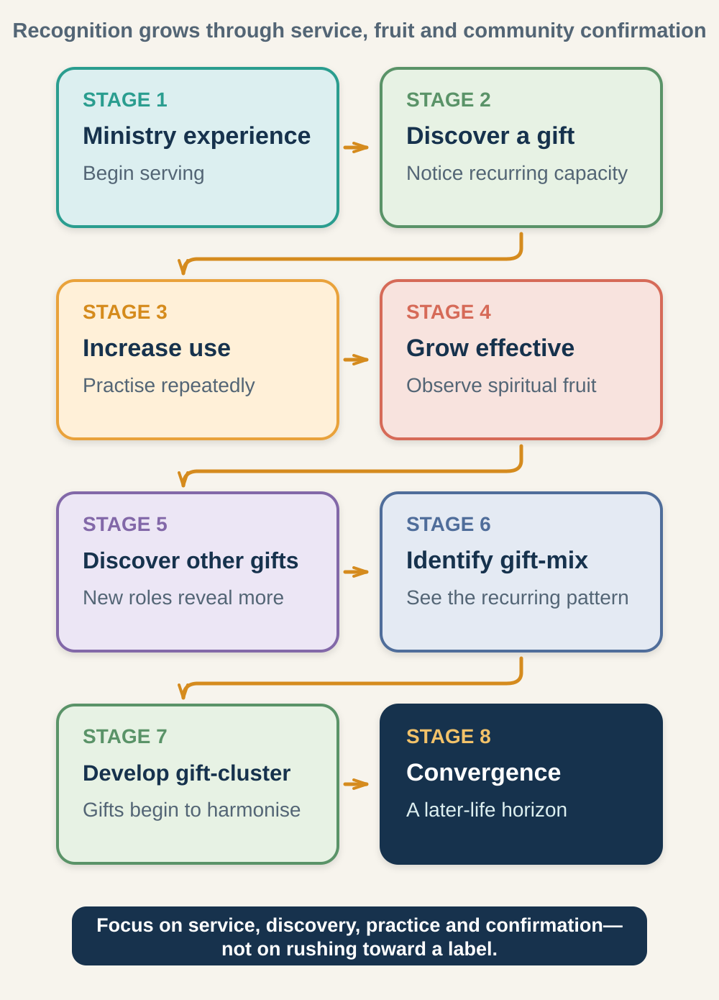

# Session 4: Discovering and Developing Your Gifts

**Phase III: Natural Abilities, Learned Skills, and Spiritual Gifts (Giftedness Set and Giftedness Development)**

**Primary phase:** Phase III (Ministry Maturing)

> ### Session at a Glance
>
> - **Individual study before the meeting:** 60–90 minutes
> - **Group session:** 75–90 minutes
> - **Practice after the meeting:** One practical exercise during the following week
>
> **Big Idea:** Giftedness is usually discovered and developed through faithful service, observable fruit, practice, and confirmation from the Christian community.

## By the End of This Session

By the end of this session, you should be able to:

- Distinguish natural abilities, acquired skills, and spiritual gifts.
- Explain gift-mix, gift-cluster, and focal element in plain language.
- Identify evidence that may point toward developing gifts.
- Avoid premature or self-serving labels.
- Design one practical experiment to develop and test a possible gift.

---

## Learn, Reflect and Apply

Move through the teaching and exercises in order. Read each section, pause for the related reflection, and record your response before continuing. Some questions are personal; you decide what you are comfortable sharing with the group.

### 4.1 Why This Matters

New leaders often ask, “What is my spiritual gift?” That is a good question, but it can become unhelpful when a label replaces service, learning, or community confirmation.

Giftedness is not merely a personal identity to discover. It is a stewardship intended to build up others.

A healthier set of questions includes:

- Where have I repeatedly been able to help people grow?
- What kind of service produces spiritual fruit?
- What do mature believers recognise in me?
- Which abilities need training?
- Where do I experience energy, burden, and effectiveness together?
- What does the church or community actually need?

### 4.2 The Three Parts of Your Giftedness (Giftedness Set)

Clinton's framework views a leader's capacity as a combination of three resources.

#### Natural Abilities

These are innate qualities or aptitudes that may be visible from an early age.

Examples include:

- Analytical thinking
- Verbal or musical ability
- Empathy
- Organisation
- Creativity
- Physical coordination
- Relational awareness
- Courage or calm under pressure

Natural ability is a gift from God, but it is not automatically a spiritual gift or mature ministry capacity.

#### Learned Skills (Acquired Skills)

These are competencies developed through study, practice, coaching, feedback, and experience.

Examples include:

- Preparing a Bible study
- Public speaking
- Facilitating discussion
- Managing a project
- Resolving conflict
- Listening well
- Writing
- Budgeting
- Planning and evaluation

Skills can strengthen the use of natural abilities and spiritual gifts. A person with a teaching gift, for example, still benefits from learning interpretation, lesson design, communication, and feedback.

#### Spiritual Gifts

Spiritual gifts are Spirit-enabled capacities given for the strengthening and service of the body of Christ. They are not badges of status. Their purpose is the good of others and the glory of God.

Different Christian traditions organise the biblical gift passages in different ways. Facilitators should respect their church's theological convictions while emphasising the shared principles of service, love, humility, fruit, and accountability.

> **Reflect and apply:** Pause here to connect the teaching with your own leadership experience.

### 4.3 Explore Your Gifts and Capacities (Giftedness Set)

> **Core exercise 4.3:** Identify the abilities, skills, and possible spiritual gifts currently visible in your service.

#### Natural Abilities

What abilities have been visible across much of your life?

> **Your response:**
>
> Write your response here.

#### Learned Skills (Acquired Skills)

What have you learned through education, practice, work, ministry, or coaching?

> **Your response:**
>
> Write your response here.

#### Possible Spiritual Gifts

What Spirit-enabled capacities may be appearing through your service?

> **Your response:**
>
> Write your response here.

### 4.4 Identify Supporting Skills

> **Go Deeper 4.4:** Explore a skill that could strengthen one possible gift or focal capacity.

Choose one possible gift or focal capacity. What skill would help you exercise it more fruitfully?

**Possible capacity**

> **Your response:**
>
> Write your response here.

**Supporting skill**

> **Your response:**
>
> Write your response here.

**How I will develop it**

> **Your response:**
>
> Write your response here.

### 4.5 One Way to Understand Different Gifts (Functional Gift Categories)

The supplied course material groups gifts by their primary contribution:

- **Word gifts** help clarify truth and guide people in understanding and response.
- **Power gifts** demonstrate dependence on God's activity and reality.
- **Love gifts** make God's care visible through practical service, generosity, mercy, help, and hospitality.

These categories are a learning aid, not a rigid classification. Gifts frequently work together.

Paul's teaching in 1 Corinthians 12–14 places giftedness within a body, insists that members need one another, and makes love essential to the exercise of every gift.

### 4.6 Three Terms You Need to Know

#### Your Current Combination of Gifts (Gift-Mix)

The set of spiritual gifts that a leader appears to use repeatedly during a season of ministry.

#### How Gifts Work Together (Gift-Cluster)

A more developed pattern in which a dominant gift is strengthened by supporting gifts, abilities, and skills.

For example, a teaching contribution may be supported by research, discernment, encouragement, communication, and pastoral sensitivity.

#### Your Central Contribution (Focal Element)

The central capacity around which a leader's most effective contribution is currently organised. It may be a spiritual gift, natural ability, or highly developed skill.

These terms should describe observed patterns, not place a person in a permanent box.

> **Reflect and apply:** Pause here to connect the teaching with your own leadership experience.

### 4.7 Describe Your Possible Contribution

> **Go Deeper 4.7:** Describe your developing contribution without treating it as a final label.

Complete this statement without treating it as final:

> **Your possible contribution:** Describe what you may be especially equipped to do, whom it could benefit, the evidence you have noticed, and where you still need practice and confirmation.
>
> Write your response here.

### 4.8 How Gifts Become Clearer Over Time (Giftedness Development Path)

*Figure 1. New leaders should concentrate on serving, noticing, practising, and receiving confirmation. Convergence is a later-life horizon, not the goal of this course.*

Giftedness commonly develops through:

1. **Ministry experience:** Begin serving in real situations.
2. **Discovery:** Notice a recurring Spirit-enabled capacity.
3. **Increased use:** Exercise it repeatedly.
4. **Effectiveness:** Observe fruit and receive confirmation.
5. **Other gifts:** New roles reveal supporting capacities.
6. **Gift-mix:** Recurring gifts become clearer.
7. **Gift-cluster:** Gifts, abilities, and skills begin to harmonise.
8. **Convergence:** Much later, a mature leader may enter a role that brings calling, giftedness, experience, and maturity into unusual alignment.

This course includes the complete pathway for orientation, but new leaders should not try to rush toward Stage 8. The immediate focus is faithful service and honest learning.

### 4.9 Signs That a Gift May Be Developing

Possible clues include:

- **Recurring fruit:** People are helped in a similar way across different situations.
- **Community confirmation:** Mature believers independently recognise the capacity.
- **Sustained burden:** You repeatedly notice and care about a particular need.
- **Appropriate energy:** The work is demanding but deeply meaningful.
- **Natural drift:** You tend to notice and respond to certain ministry opportunities.
- **Learning response:** Practice and feedback produce growing effectiveness.
- **Role demand:** A new responsibility draws out a capacity that was not previously visible.

No single clue is conclusive. Enjoyment alone is not proof, and difficulty does not automatically mean a person lacks a gift.

> **Reflect and apply:** Pause here to connect the teaching with your own leadership experience.

### 4.10 What Evidence Do You Have?

> **Core exercise 4.10:** Record observable fruit, ministry examples, and community confirmation.

For each possible gift, record evidence rather than relying only on preference.

1. **Possible gift or capacity 1**

   > **Your response:** Possible gift; ministry examples; fruit observed; confirmation received; development needed.

2. **Possible gift or capacity 2**

   > **Your response:** Possible gift; ministry examples; fruit observed; confirmation received; development needed.

3. **Possible gift or capacity 3**

   > **Your response:** Possible gift; ministry examples; fruit observed; confirmation received; development needed.

### 4.11 Test a Possible Gift Through Service

> **Core exercise 4.11:** Design a small, time-limited experiment that will benefit other people.

Choose a small, time-limited opportunity to test and develop a possible gift.

| Element | My plan |
|---|---|
| Capacity I want to explore |  |
| Service opportunity |  |
| People who should benefit |  |
| Supporting skill to practise |  |
| Person who will observe or give feedback |  |
| Date for review |  |

### 4.12 Notice Which Leaders and Ministries Draw You (Like-Attracts-Like)

Emerging leaders are often drawn to mature leaders with similar gifts or burdens. This can provide mentoring and a model for development.

It can also create blind spots. A leader may copy another person's style instead of developing an authentic expression of the gift. Seek mentors who share your strengths and mentors who can challenge your limitations.

> **Reflect and apply:** Pause here to connect the teaching with your own leadership experience.

### 4.13 Notice Your Giftedness Clues

> **Go Deeper 4.13:** Look for recurring needs, burdens, fruit, and leaders who draw your attention.

Which needs do you notice quickly?

> **Your response:**
>
> Write your response here.

Which kinds of service repeatedly draw you?

> **Your response:**
>
> Write your response here.

When have people been spiritually helped through your contribution?

> **Your response:**
>
> Write your response here.

Which leaders are you drawn to, and what capacities do you recognise in them?

> **Your response:**
>
> Write your response here.

### 4.14 Character Must Support Giftedness

Giftedness does not prove maturity. A person may exercise a real capacity while still needing substantial growth in humility, reliability, boundaries, truthfulness, or relationships.

Ask two questions together:

1. What capacity appears to be developing?
2. What character is required to carry it safely?

> **Reflect and apply:** Pause here to connect the teaching with your own leadership experience.

### 4.15 Identify the Character Required

> **Core exercise 4.15:** Name the character needed to carry a possible capacity safely.

What character quality is especially important for the healthy use of this capacity?

> **Your response:**
>
> Write your response here.

What could happen if that character quality remains underdeveloped?

> **Your response:**
>
> Write your response here.

### 4.16 Leadership Story: A.W. Tozer — When Giftedness, Discipline, and Opportunity Come Together

**Source type:** Biographical and denominational history

#### The Setting

Returning to Tozer's story allows us to see that the same life can illustrate more than one development phase.

Session 1 examined how his early background formed possible strengths and vulnerabilities. Session 4 considers how those capacities became increasingly visible and effective through ministry experience.

Tozer served churches before moving to Chicago, where he pastored Southside Alliance Church for approximately thirty years. In 1950, he also became editor of the Alliance's denominational magazine. These responsibilities expanded his influence beyond face-to-face pastoral ministry. [The Christian and Missionary Alliance's history](https://cmalliance.org/who-we-are/our-history/) records his long Chicago pastorate and later editorial role.

#### How His Gifts Developed

Tozer's contribution did not rest on one isolated gift. It involved a developing combination of resources.

**Natural abilities may have included:**

- Penetrating observation
- Strong verbal expression
- Intellectual curiosity
- Comfort with reflection and solitude

**Acquired skills included:**

- Sustained reading and study
- Sermon preparation
- Writing and editing
- Communicating complex spiritual ideas
- Pastoral observation developed over years

**Spiritual capacities appeared through:**

- Teaching
- Exhortation
- Spiritual discernment
- Prophetic challenge in the broad sense of calling the church back to faithfulness

Prayer and study supported public proclamation. Writing and editing extended the reach of teaching. Pastoral experience gave Tozer continuing contact with the spiritual needs of ordinary believers.

Over time, these capacities began functioning as a gift-cluster rather than unrelated abilities.

#### Opportunity and Focus

Chicago provided a setting in which Tozer's developing capacities could reach more people. His ministry expanded through preaching, publishing, conference work, and denominational influence.

The move did not create his capacities. It provided a larger environment in which developed capacities could be exercised.

This distinction is important for new leaders. A bigger role cannot compensate for an undeveloped inner life, weak skills, or lack of evidence. Opportunity reveals and extends what has already been forming.

Tozer also illustrates the need for boundaries and focus. A leader cannot pursue every opportunity equally. Fruitfulness may require protecting time for the practices that nourish the leader's most important contribution.

#### What New Leaders Can Learn

Giftedness becomes clearer through the interaction of:

- Real ministry experience
- Repeated use
- Observable fruit
- Skill development
- Community recognition
- Appropriate opportunity
- Disciplined supporting practices

New leaders should not ask only, “What is my gift?” They should also ask:

> What habits, skills, relationships, and ministry opportunities will help this capacity serve others well?

#### Reading and Applying This Story Wisely

Do not treat Tozer's ministry pattern as universally ideal. Long periods of solitude may support one leader and isolate another. The goal is not to copy his routine but to understand how practices can support a particular contribution.

Public reach is not proof of greater spiritual worth. A strong focal element should not excuse relational or organisational weaknesses.

#### Reflect and Discuss

> **Go Deeper 4.16:** Use these questions for further personal reflection or discussion.

1. Which elements formed Tozer's giftedness set?
2. How did acquired skills support his spiritual contribution?
3. What changed when his ministry environment expanded?
4. Which practice appears essential to your developing contribution?
5. What small opportunity could help you test and strengthen a possible gift?

### 4.17 In Summary

1. Giftedness is for service, not status.
2. Natural abilities, skills, and spiritual gifts are related but distinct.
3. Gifts are normally clarified through practice, fruit, and community confirmation.
4. A gift label should remain provisional while evidence develops.
5. Skills and character support the healthy use of gifts.
6. New leaders should focus on faithful experimentation, not convergence.

> **Bring it together:** Review the session, prepare for the group conversation, and identify your next faithful step.

### 4.18 Choose What You Will Share

> **Core exercise 4.18:** Prepare one possible capacity, its evidence, and one uncertainty for group discussion.

Which section or exercise do you want to refer to during the discussion? For example, **4.10**.

> **Your response:**
>
> Write your response here.

One possible capacity I am willing to discuss:

> **Your response:**
>
> Write your response here.

One piece of evidence or uncertainty:

> **Your response:**
>
> Write your response here.

One question for the group:

> **Your response:**
>
> Write your response here.

### 4.19 Between Sessions: Complete Your Gift-Development Experiment

Complete the development experiment. Afterward, ask:

1. Who was helped, and how?
2. What came naturally?
3. What required skill development?
4. What feedback did I receive?
5. Should I repeat, adjust, or discontinue the experiment?
