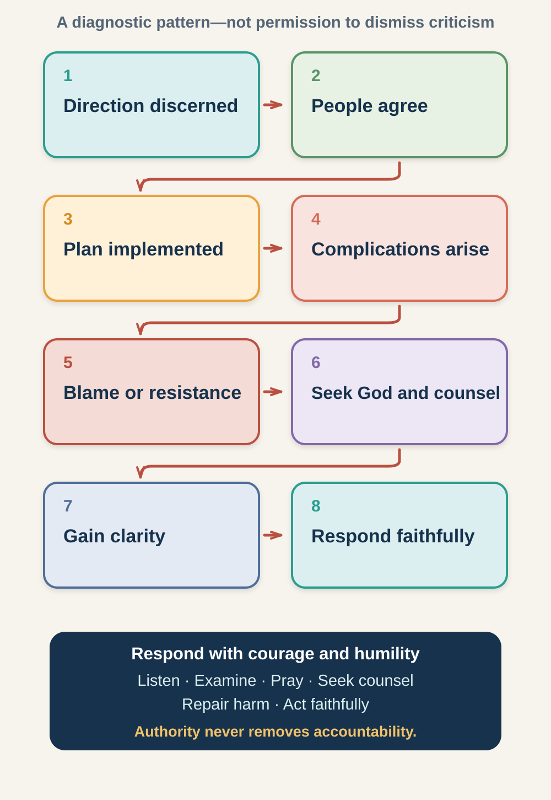

# Session 5: Leading Through Conflict and Relationships

**Phase III: Authority, Criticism, Humility, and Accountability (Submission Cluster and Leadership Backlash)**

**Primary phase:** Phase III (Ministry Maturing)

> ### Session at a Glance
>
> - **Individual study before the meeting:** 60–90 minutes
> - **Group session:** 75–90 minutes
> - **Practice after the meeting:** One practical exercise during the following week
>
> **Big Idea:** Spiritual authority grows through character, service, truth, humility, and accountability—not through control, self-protection, or position alone.

## By the End of This Session

By the end of this session, you should be able to:

- Distinguish spiritual influence from positional power.
- Describe relational experiences that mature a leader.
- Use the backlash cycle as a diagnostic rather than a defence.
- Respond to criticism with listening, discernment, courage, and accountability.
- Identify one relational habit that needs to change.

---

## Learn, Reflect and Apply

Move through the teaching and exercises in order. Read each section, pause for the related reflection, and record your response before continuing. Some questions are personal; you decide what you are comfortable sharing with the group.

### 5.1 Why This Matters

Leadership is relational. Even a sound idea can be damaged by poor listening, defensive behaviour, unclear communication, misuse of authority, or failure to understand the people affected.

New leaders often discover that responsibility brings tension:

- People disagree with a decision.
- A plan becomes more difficult than expected.
- Expectations were never clarified.
- A leader receives unfair criticism.
- A leader receives fair criticism in an uncomfortable form.
- Authority shifts from one person to another.
- Team members have different gifts, cultures, or communication styles.

These experiences can become a school of humility, courage, relational wisdom, and dependence on God.

### 5.2 How Relationships and Authority Develop Leaders (Submission Cluster)

Clinton uses the idea of a **submission cluster** for relational experiences that shape a leader's understanding of authority and response to conflict. This can include:

- **Authority insights:** learning how legitimate authority should be exercised and received.
- **Relational insights:** understanding people, communication, trust, and difference.
- **Ministry conflict:** learning to address disagreement truthfully and constructively.
- **Leadership backlash:** facing resistance or blame when a direction becomes costly.

Submission does not mean passivity, silence, or unquestioning compliance. Healthy submission exists within mutual accountability to God, Scripture, truth, love, and appropriate human structures.

> **Reflect and apply:** Pause here to connect the teaching with your own leadership experience.

### 5.3 Notice How You Respond to Tension

> **Core exercise 5.3:** Identify your common reactions when relationships become difficult.

When criticised, I tend to:

- [ ] Defend myself quickly
- [ ] Withdraw or become silent
- [ ] Blame others
- [ ] Seek allies
- [ ] Over-apologise to restore approval
- [ ] Listen and ask questions
- [ ] Delay action indefinitely
- [ ] Seek wise counsel
- [ ] Another response not listed above

What fear or desire may drive this response?

> **Your response:**
>
> Write your response here.

### 5.4 Position, Authority, and Influence

#### Positional Power

This comes from an assigned role and gives a person legitimate responsibility to make certain decisions.

#### Relational Trust

This grows when people experience the leader as truthful, competent, caring, consistent, and willing to listen.

#### Spiritual Authority

This is recognised influence arising from character, truth, service, wisdom, and dependence on God. It cannot be manufactured by demanding loyalty.

A healthy leader uses legitimate position in a way that builds trust and serves others. A title may authorise a decision, but it does not make every decision wise or remove the need for accountability.

### 5.5 When People Resist a Leadership Decision (Leadership Backlash Cycle)

*Figure 1. The cycle is a diagnostic pattern. It must not be used to dismiss criticism or portray every disagreement as rebellion.*

The pattern may unfold as follows:

1. A leader discerns a direction.
2. People initially agree.
3. The plan is implemented.
4. Unexpected complications arise.
5. Blame, resistance, or withdrawal appears.
6. The leader seeks God, counsel, evidence, and self-examination.
7. Greater clarity emerges.
8. The leader responds faithfully through adjustment, perseverance, repair, or change.

Clinton's original pattern emphasises recourse to God and divine vindication. For new leaders, it is important to hold this together with humility and accountability. A leader should never assume that resistance proves the leader is right.

> **Reflect and apply:** Pause here to connect the teaching with your own leadership experience.

### 5.6 Map a Leadership-Resistance Experience (Backlash Cycle)

> **Core exercise 5.6:** Use the cycle to understand one experience without using it to dismiss criticism.

| Stage | What happened or may happen? | Faithful response |
|---|---|---|
| Direction |  |  |
| Agreement |  |  |
| Implementation |  |  |
| Complication |  |  |
| Resistance or blame |  |  |
| Prayer, counsel, and examination |  |  |
| Greater clarity |  |  |
| Faithful response |  |  |

### 5.7 Not All Criticism Is the Same

Discernment improves when criticism is not treated as one undifferentiated threat.

1. **Accurate criticism:** It identifies a genuine error, weakness, or harm.
2. **Partly accurate criticism:** The tone or conclusion may be unfair, but important truth is present.
3. **Preference conflict:** People want different methods or outcomes.
4. **Communication failure:** The direction, reasons, authority, or expectations were unclear.
5. **Destructive attack:** The response includes deception, intimidation, abuse, or deliberate sabotage.

Each kind requires a different response. Even when criticism is malicious, the leader should still examine whether any truth is present and use appropriate accountability and safety processes.

### 5.8 How to Respond When People Resist

When tension rises:

1. **Pause.** Do not respond from panic, anger, or wounded pride.
2. **Listen.** Ask what people experienced and what evidence they have.
3. **Examine.** Consider motives, process, communication, impact, and authority.
4. **Pray.** Seek God without using prayer to avoid responsibility.
5. **Seek counsel.** Include people who can disagree with you honestly.
6. **Repair harm.** Apologise, correct, compensate, or change course where needed.
7. **Clarify direction.** Explain what remains true and what must change.
8. **Act faithfully.** Persevere, adjust, wait, or stop as discernment requires.

> **Reflect and apply:** Pause here to connect the teaching with your own leadership experience.

### 5.9 Reflect on a Recent Conflict

> **Core exercise 5.9:** Examine one conflict with humility, evidence, safety, and accountability in view.

Describe the situation without naming people unnecessarily.

> **Your response:**
>
> Write your response here.

What did you want?

> **Your response:**
>
> Write your response here.

What might the other person or group have experienced?

> **Your response:**
>
> Write your response here.

Which kind of criticism was present: accurate, partly accurate, preference, communication failure, or destructive attack?

> **Your response:**
>
> Write your response here.

What part is yours to own?

> **Your response:**
>
> Write your response here.

What boundary or accountability process may be needed?

> **Your response:**
>
> Write your response here.

### 5.10 Receiving Criticism Without Immediate Self-Defence (Non-Defensiveness)

The course material draws from Watchman Nee's emphasis that delegated spiritual authority does not need to be protected through manipulation, political manoeuvring, or angry self-defence.

Non-defensiveness does not mean refusing to explain a decision, tolerating falsehood, or neglecting due process. It means the leader does not make preservation of reputation the highest goal.

A non-defensive leader can say:

- “I may have missed something. Help me understand.”
- “That part of the criticism is accurate.”
- “I am responsible for the impact of my decision.”
- “I disagree, but I want to respond respectfully.”
- “This matter requires a formal review.”
- “For safety and truth, I need to document what occurred.”

> **Reflect and apply:** Pause here to connect the teaching with your own leadership experience.

### 5.11 Examine the Need to Be Right

> **Go Deeper 5.11:** Explore how the desire to be right may affect listening and relationships.

Where might your need to be right be creating unnecessary friction?

> **Your response:**
>
> Write your response here.

What would humility require?

> **Your response:**
>
> Write your response here.

What conviction should not be abandoned?

> **Your response:**
>
> Write your response here.

### 5.12 Leadership Story: Barnabas and Paul — When a Mentor Makes Room for Another Leader

**Source type:** Biblical account

#### The Setting

Barnabas was already a trusted leader when Paul was still viewed with suspicion.

After Paul's conversion, believers in Jerusalem were understandably afraid of him because of his earlier persecution of Christians. Barnabas took the relational risk of introducing Paul to the apostles and explaining what had happened (Acts 9:26–28).

Later, when the work in Antioch was growing, Barnabas went to Tarsus to find Paul and bring him into the ministry there (Acts 11:25–26). This was more than offering encouragement from a distance. Barnabas gave Paul access to relationship, responsibility, ministry experience, and a community in which his gifts could develop.

A study of their mentoring relationship describes Barnabas as sponsor, mentor, ministry partner, and eventually a leader who had to adapt as Paul's influence grew. [Regent University's study of Barnabas and Paul](https://www.regent.edu/journal/journal-of-biblical-perspectives-in-leadership/mentoring-stages-in-the-relationship-between-barnabas-and-paul/) traces this development through Acts.

#### How the Relationship Changed

At the beginning of the first missionary journey, Barnabas appears to carry greater recognised standing. As the journey develops, Paul becomes increasingly prominent in proclamation and confrontation.

The order of their names changes in the narrative, although not consistently enough to prove a formal transfer of office. It is best to say that Acts portrays a changing partnership in which Paul's contribution becomes more visible.

Scripture does not record Barnabas announcing that he was stepping down. His maturity is inferred from his continuing participation and apparent willingness to make room for Paul's developing contribution.

This is an important leadership transition. An insecure mentor may:

- Restrict the emerging leader
- Compete for recognition
- Keep all significant opportunities
- Interpret growth as disloyalty
- Demand permanent dependence

Barnabas instead repeatedly opened doors for other people.

#### The Conflict

The relationship was not free from conflict. In Acts 15, Barnabas wanted to take John Mark on another journey, while Paul strongly disagreed because Mark had previously withdrawn.

Their disagreement became sharp, and they formed separate teams.

The text does not provide enough information to declare that one leader was entirely right and the other entirely wrong. It shows that sincere, experienced leaders can reach different judgments and that conflict may produce genuine relational cost.

Barnabas continued investing in Mark. Paul later spoke positively of Mark's usefulness, suggesting that early failure did not define Mark permanently.

#### What New Leaders Can Learn

Barnabas demonstrates that leadership multiplication requires more than identifying potential. It requires:

- Taking relational risks
- Opening access
- Sharing meaningful responsibility
- Allowing another person's gifts to become visible
- Adapting when the relationship changes
- Continuing to invest in people others may have dismissed

#### Reading and Applying This Story Wisely

Avoid stating as fact that Barnabas formally handed leadership to Paul. That is a reasonable leadership inference, but the biblical text is more nuanced.

Do not use the story to suggest that mentors should tolerate disrespect or abandon legitimate responsibilities.

#### Reflect and Discuss

> **Go Deeper 5.12:** Use these questions for further personal reflection or discussion.

1. What risks did Barnabas take in supporting Paul?
2. What might have happened if Barnabas had protected his position?
3. How can a mentor make room without withdrawing needed guidance?
4. What does the conflict over Mark reveal about leadership judgment?
5. Whose developing contribution may require you to share opportunity or recognition?

### 5.13 Authority Must Remain Accountable

Spiritual authority must never be used to:

- Silence questions
- Demand personal loyalty
- Excuse misconduct
- Bypass financial or safeguarding controls
- Threaten people with spiritual consequences for disagreement
- Prevent someone from seeking outside help
- Hide information that should be reported
- Require submission to an unlawful or harmful instruction

Authority never removes accountability.

> **Reflect and apply:** Pause here to connect the teaching with your own leadership experience.

### 5.14 How Are You Using Authority?

> **Core exercise 5.14:** Review whether your use of authority remains relational, truthful, and accountable.

Which statement most needs attention?

- [ ] I explain the limits of my authority.
- [ ] I welcome appropriate questions.
- [ ] I distinguish disagreement from disloyalty.
- [ ] I seek counsel from people who can challenge me.
- [ ] I admit mistakes and repair harm.
- [ ] I use confidential information responsibly.
- [ ] I do not use spiritual language to pressure people.
- [ ] I know when a formal process is required.

**My growth priority**

> **Your response:**
>
> Write your response here.

### 5.15 In Summary

1. Leadership is relational, not merely directional.
2. Position grants responsibility but does not guarantee wisdom.
3. Resistance may contain truth, misunderstanding, preference, or hostility.
4. The backlash cycle is a diagnostic, not a defence.
5. Non-defensiveness includes listening, truth, repair, and appropriate process.
6. Mature authority serves and remains accountable.

> **Bring it together:** Review the session, prepare for the group conversation, and identify your next faithful step.

### 5.16 Choose What You Will Share

> **Core exercise 5.16:** Prepare one insight you can discuss without disclosing confidential details.

Which section or exercise do you want to refer to during the discussion? For example, **5.9**.

> **Your response:**
>
> Write your response here.

One relational pattern I am willing to discuss:

> **Your response:**
>
> Write your response here.

One principle or question I am bringing:

> **Your response:**
>
> Write your response here.

### 5.17 Choose One Next Step

> **Core exercise 5.17:** Identify one safe and faithful relational response.

Choose one:

- Ask a clarifying question before defending yourself.
- Acknowledge one accurate part of criticism.
- Repair a communication failure.
- Seek counsel from someone who can disagree with you.
- Establish a needed boundary or formal process.
- Support another person's growing influence.

**My action**

> **Your response:**
>
> Write your response here.

**My target completion date**

> **Your response:**
>
> Write your response here.

### 5.18 Between Sessions: Practise a Non-Defensive Conversation

Have one appropriate conversation using this sequence:

1. “I want to understand what you experienced.”
2. “What impact did my action or communication have?”
3. “This is what I hear you saying…”
4. “This is the part I can own…”
5. “This is what I propose as a next step…”

Do not use this exercise in an unsafe or abusive situation without appropriate support.

**What I learned**

> **Your response:**
>
> Write your response here.
