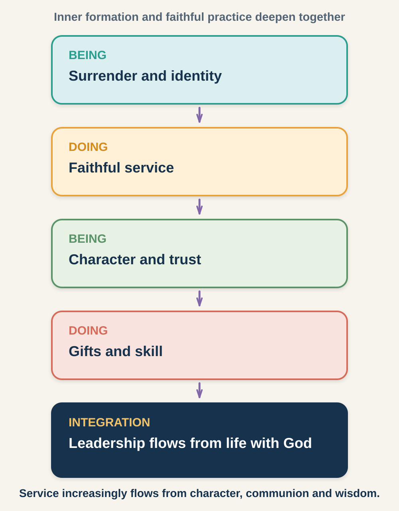

# Session 6: Leading From Spiritual Depth

**Phase IV: Moving From Doing to Being, with a 90-Day Growth Plan (Life Maturing)**

**Primary phase:** Phase IV (Life Maturing)

> ### Session at a Glance
>
> - **Individual study before the meeting:** 75–100 minutes
> - **Group session:** 90 minutes
> - **Practice after the meeting:** One practical exercise during the following week
>
> **Big Idea:** Mature leadership increasingly flows from an integrated life with God, where character, communion, values, gifts, and service support one another.

## By the End of This Session

By the end of this session, you should be able to:

- Explain the movement from doing-centred leadership toward leadership flowing from being.
- Identify warning signs of a leadership plateau.
- Name prayer, faith, influence, or growth challenges that may expand capacity.
- Write two explicit leadership values.
- Create a mentor-supported 90-day development plan integrating Phases I–IV.

---

## Learn, Reflect and Apply

Move through the teaching and exercises in order. Read each section, pause for the related reflection, and record your response before continuing. Some questions are personal; you decide what you are comfortable sharing with the group.

### 6.1 What Growing Into Spiritual Depth Means for a New Leader (Life Maturing)

**Life Maturing** normally develops through sustained experience. New leaders should not claim mature status simply because they understand the term. Nevertheless, it is helpful to see the direction of healthy development from the beginning.

The goal is not merely to become busier, more visible, or more skilled. It is to become a person whose service increasingly flows from:

- A deep relationship with God
- Tested character
- Wise use of gifts and skills
- Honest self-awareness
- Healthy relationships and accountability
- Clear values
- Sustainable patterns of life and service

Life Maturing reminds new leaders to build foundations that can carry influence over time.

### 6.2 When Service Flows From Your Life With God (Doing-to-Being Movement)

Early leaders often define progress by activity:

- How much did I accomplish?
- How many people attended?
- Was I given a larger role?
- Did the presentation succeed?
- Did people recognise my contribution?

These questions are not always wrong, but they are incomplete. Mature reflection also asks:

- What kind of person am I becoming?
- Is my public ministry consistent with my private life?
- Does activity flow from communion with God or replace it?
- Are people being loved, or merely used to accomplish goals?
- Am I becoming more humble, truthful, courageous, and free?
- Can I remain faithful when results are unclear?

*Figure 1. Christian leadership matures through an ongoing rhythm of inner formation and faithful action.*

The movement from doing to being does not mean that mature leaders stop acting, planning, or achieving. It means that action increasingly flows from identity in Christ, character, wisdom, and dependence on God.

> **Reflect and apply:** Pause here to connect the teaching with your own leadership experience.

### 6.3 Is Your Service Flowing From Spiritual Depth?

> **Core exercise 6.3:** Examine whether your service is flowing from your life with God.

Rate each statement from 1 to 5, where 1 means “rarely true” and 5 means “consistently true.”

| Statement | Rating | Evidence or concern |
|---|---:|---|
| My service flows from an active relationship with God. |  |  |
| My private and public lives are increasingly consistent. |  |  |
| I can rest without feeling that my worth has decreased. |  |  |
| I receive correction without collapsing or attacking. |  |  |
| I can serve faithfully without immediate visible results. |  |  |
| My relationships are not merely instruments for achieving goals. |  |  |
| My schedule reflects my stated priorities. |  |  |

What pattern do you notice?

> **Your response:**
>
> Write your response here.

### 6.4 How Life Experiences Deepen a Leader

God may use significant life experiences to deepen a leader. These can include:

- Success that tests humility
- Failure that exposes self-reliance
- Criticism that reveals insecurity
- Waiting that develops patience
- Loss that clarifies what matters
- Isolation that deepens dependence on God
- Transition that requires renewed trust
- Relational conflict that develops courage and compassion
- Limits that teach sustainable service

Not every hardship should be romanticised as a leadership lesson. Pain may require grief, safety, justice, counselling, and time. The leader's task is not to manufacture a lesson but to remain open to truthful reflection and God's redemptive work.

### 6.5 Recognising When Growth Has Stalled (Plateau Barrier)

A **plateau** occurs when a leader stops developing and relies mainly on previous learning, familiar skills, or established reputation.

Four warning signs deserve attention.

#### 1. Laxity in Spiritual Disciplines

Prayer, Scripture, worship, community, and rest become irregular or merely functional. The leader prepares material for others but neglects personal attentiveness to God.

#### 2. No Personal Growth Projects

The leader is no longer learning, receiving coaching, reading beyond familiar material, developing skills, or testing assumptions.

#### 3. Avoiding Necessary Conflict

The leader chooses comfort over truth, delays difficult conversations, or preserves surface peace while problems deepen.

#### 4. Little Interest in Raising Up New Leaders

The leader becomes protective of role or recognition and loses interest in encouraging, developing, releasing, or learning from others.

One sign alone does not prove a plateau. Fatigue, grief, illness, or unusual demands may temporarily affect normal practices. Discernment should be compassionate and contextual.

> **Reflect and apply:** Pause here to connect the teaching with your own leadership experience.

### 6.6 Check Whether Your Growth Has Stalled

> **Core exercise 6.6:** Notice any plateau warning sign that needs attention.

Which warning sign most needs attention?

- [ ] Laxity in spiritual disciplines
- [ ] No personal growth project
- [ ] Avoiding necessary conflict
- [ ] Little interest in raising up new leaders

What evidence supports your answer?

> **Your response:**
>
> Write your response here.

What contextual factor—fatigue, grief, health, workload, or transition—should also be considered?

> **Your response:**
>
> Write your response here.

### 6.7 Four Ways Leaders Are Stretched (Developmental Challenges)

The supplied framework describes several challenges that may help a leader grow beyond settled patterns.

#### Prayer Challenge

A situation exposes the inadequacy of technique alone and draws the leader into more intentional dependence on God.

#### Faith Challenge

The leader is invited to take a wise, accountable step beyond present comfort. Faith is not recklessness; it acts on discerned conviction with appropriate counsel and stewardship.

#### Influence Challenge

The leader is asked to serve beyond a familiar relationship, culture, team, or setting. This requires listening, learning, adaptation, and humility.

#### Growth Challenge

The leader intentionally develops knowledge, skill, character, or relational capacity rather than coasting on past success.

### 6.8 Practising Dependence on God (Power Cluster)

Christian leadership cannot be reduced to technique. The course material highlights several ways leaders learn dependence on God's power:

- **Gifted power:** the Holy Spirit works through a gift for the good of others.
- **Prayer power:** situations are changed or sustained through prayer.
- **Power encounter:** evil, deception, or spiritual opposition is confronted through God's truth and power.
- **Networking power:** God uses mentors, peers, partners, and strategic relationships to connect people and resources.

These ideas require humility and discernment. Claims of supernatural guidance or power should never bypass Scripture, accountability, safeguarding, or careful examination. Dramatic experience is not a substitute for character.

> **Reflect and apply:** Pause here to connect the teaching with your own leadership experience.

### 6.9 Where Are You Being Stretched?

> **Go Deeper 6.9:** Explore a prayer, faith, influence, or growth challenge in greater detail.

Which challenge may be most relevant?

- [ ] Prayer challenge
- [ ] Faith challenge
- [ ] Influence challenge
- [ ] Growth challenge

Describe the invitation or need.

> **Your response:**
>
> Write your response here.

What would a wise, accountable response look like?

> **Your response:**
>
> Write your response here.

Who should help you discern it?

> **Your response:**
>
> Write your response here.

### 6.10 Leadership Story: Watchman Nee at Ta-Wang — Faith, Discernment, and the Danger of Presumption

**Source type:** Leader's reported testimony

#### About This Account

This incident is presented in Watchman Nee's own ministry testimony and repeated in later Christian biographies. It should be introduced as a **reported testimony**, not as an independently verified historical event.

#### The Setting

In 1925, Watchman Nee and a small evangelistic team travelled to an island village off the South China coast. Their preaching met strong resistance because the community's confidence was tied to a local deity called Ta-Wang.

Villagers believed Ta-Wang's power was demonstrated by favourable weather on the annual festival day.

During an exchange with villagers, an eager young member of Nee's team promised that it would rain on the festival day. According to Nee's account, this statement was made before the team had prayerfully agreed on such a public challenge.

Nee was alarmed.

The situation was no longer only about opposition from the village. It became a discernment crisis within the ministry team. Had the young believer acted in faith, or had he acted presumptuously? Should the team withdraw the statement, leave the village, or pray that God would intervene?

#### From Impulse to Shared Discernment

The team prayed and came to believe that they should remain and trust God in the situation.

Nee's account reports that rain disrupted the appointed festival morning. When local leaders attempted to reschedule the event, further rain disrupted the revised plans. The incident opened the village to the team's message. A summary of Nee's account appears in [Bible.org's Watchman Nee biography](https://bible.org/node/13395).

The story is often presented only as a dramatic power encounter. For leadership development, the internal team process is equally important.

The developmental issues include:

- An inexperienced member made a public commitment.
- The senior leader did not respond impulsively.
- The team brought the situation to God together.
- They had to distinguish faith from presumption.
- The outcome affected the credibility of the entire team.
- Public spiritual claims carried serious responsibility.

#### What New Leaders Can Learn

A power encounter should never be treated as a technique for proving a leader's importance. The central issue is God's credibility, not the leader's reputation.

New leaders should learn that bold faith requires:

- Biblical consistency
- Prayerful discernment
- Corporate accountability
- Humility about what has and has not been revealed
- Willingness to accept correction
- Care for the people affected
- Refusal to manipulate results or testimony

The most mature part of the story may not be the dramatic outcome. It may be the movement from one person's impulsive declaration to the team's serious prayer and shared discernment.

#### Why This Matters for Mature Leadership

Life Maturing involves learning that leadership cannot depend only on methods, charisma, or past experience. Leaders face situations in which their resources are inadequate and dependence on God becomes unavoidable.

At the same time, dependence on God must not become an excuse for irresponsibility. Mature leaders combine prayer with truth, testing, counsel, safeguards, and accountability.

#### Reading and Applying This Story Wisely

Do not encourage participants to imitate the public weather challenge or manufacture a confrontation with another religion.

Do not teach that faith requires making unverified promises on God's behalf.

A dramatic testimony should never become the standard by which ordinary faithfulness is judged. God's power is also displayed through perseverance, repentance, truth, compassion, reconciliation, and faithful service.

#### Reflect and Discuss

> **Go Deeper 6.10:** Use these questions for further personal reflection or discussion.

1. What leadership problem was created by the young team member's promise?
2. How did the situation require both faith and discernment?
3. What is the difference between courageous faith and spiritual presumption?
4. Why must public claims about God be handled carefully?
5. Where are you being invited to depend on God without abandoning wisdom and accountability?
6. What quieter expressions of God's power have you witnessed through prayer, truth, endurance, or transformed character?

> **Reflect and apply:** Pause here to connect the teaching with your own leadership experience.

### 6.11 Name What You Need to Release or Entrust to God

> **Go Deeper 6.11:** Consider what may need to be surrendered rather than controlled.

Complete one statement:

Choose one sentence starter and complete it:

- I need to release my right to…
- I need to stop protecting…
- I need to trust God with…
- I need to receive help concerning…

> **Your response:**
>
> Write your response here.

### 6.12 Turn Your Convictions Into Clear Commitments (Explicit Leadership Values)

A **leadership value** is a conviction that consistently shapes how a leader perceives, decides, and acts.

Values become more useful when written clearly.

Clinton uses three forms to express strength of conviction:

- **Should:** a preferred practice or wise guideline.
- **Ought to:** a strong responsibility or rule of conscience.
- **Must:** a non-negotiable commitment.

Examples:

- “I **must** tell the truth about results, even when the truth is disappointing.”
- “I **ought to** seek the perspective of people affected before making a major change.”
- “I **should** build regular periods of reflection into every ministry project.”

A good value is:

- Clear enough to guide a decision
- Grounded in Scripture and sound wisdom
- Observable in practice
- Broad enough to apply across situations
- Open to refinement as understanding matures

> **Reflect and apply:** Pause here to connect the teaching with your own leadership experience.

### 6.13 Write Your Leadership Commitments

> **Core exercise 6.13:** Turn two important convictions into clear leadership commitments.

Write two values arising from your development so far.

#### Value 1

> **My first leadership commitment:** Complete the sentence, “As a leader, I must, ought to, or should…”
>
> Write your response here.

Why this matters:

> **Your response:**
>
> Write your response here.

What behaviour would demonstrate it?

> **Your response:**
>
> Write your response here.

#### Value 2

> **My second leadership commitment:** Complete the sentence, “As a leader, I must, ought to, or should…”
>
> Write your response here.

Why this matters:

> **Your response:**
>
> Write your response here.

What behaviour would demonstrate it?

> **Your response:**
>
> Write your response here.

### 6.14 What Growth Should Look Like After the Course

Completion is not measured by how many terms you remember. A better measure is whether you can name:

- One formative influence you understand more clearly
- One character area requiring growth
- One responsibility in which to practise faithfulness
- One capacity to develop
- One relationship or authority habit to strengthen
- One spiritual practice or value that will shape your next season

> **Reflect and apply:** Pause here to connect the teaching with your own leadership experience.

### 6.15 Review Your Development Across Phases I–IV

> **Go Deeper 6.15:** Review the larger pattern of your development across the four phases.

| Phase | What I have recognised | My next developmental response |
|---|---|---|
| Phase I (Sovereign Foundations) |  |  |
| Phase II (Inner-Life Growth) |  |  |
| Phase III (Ministry Maturing) |  |  |
| Phase IV (Life Maturing) |  |  |

### 6.16 Create Your 90-Day Development Plan

> **Core exercise 6.16:** Build a focused and realistic plan for continued formation.

Choose a small number of priorities. A plan with too many goals is unlikely to be completed. For each priority, identify a specific action, support or resource, evidence of progress, and a review date.

**Character quality**

> **Your response:** Specific action; support or resource; evidence of progress; review date.

**Spiritual practice**

> **Your response:** Specific action; support or resource; evidence of progress; review date.

**Ministry responsibility**

> **Your response:** Specific action; support or resource; evidence of progress; review date.

**Gift or skill experiment**

> **Your response:** Specific action; support or resource; evidence of progress; review date.

**Relationship or authority habit**

> **Your response:** Specific action; support or resource; evidence of progress; review date.

### 6.17 Choose Mentoring and Accountability Support

> **Core exercise 6.17:** Identify who can encourage, observe, and challenge your continued growth.

**My mentor or accountability partner**

> **Your response:**
>
> Write your response here.

**How and when we will meet or check in**

> **Your response:**
>
> Write your response here.

I give this person permission to ask me about:

> **Your response:**
>
> Write your response here.

I will ask this person for help when:

> **Your response:**
>
> Write your response here.

### 6.18 In Summary

1. Life Maturing is a long-term direction, not a status for new leaders to claim.
2. Mature doing increasingly flows from being with God.
3. Plateaus often appear through neglected formation, learning, truth, or mentoring.
4. Growth challenges require faith and accountability, not recklessness.
5. Spiritual power never removes the need for character or safeguards.
6. Explicit values and a reviewed plan turn insight into continued development.

> **Bring it together:** Review the session, prepare for the group conversation, and identify your next faithful step.

### 6.19 Choose What You Will Share

> **Core exercise 6.19:** Prepare one course insight, one priority, and one prayer request for the group.

Which section or exercise do you want to refer to during the discussion? For example, **6.16**.

> **Your response:**
>
> Write your response here.

One major insight from the course:

> **Your response:**
>
> Write your response here.

One 90-day priority I am willing to discuss:

> **Your response:**
>
> Write your response here.

One way the group can pray for me:

> **Your response:**
>
> Write your response here.

### 6.20 After the Course: Review Your Plan at 30, 60, and 90 Days

Review your plan after 30, 60, and 90 days.

At each review, ask:

1. What have I completed?
2. What evidence of growth can I see?
3. What resistance or obstacle appeared?
4. What feedback have I received?
5. What should I continue, adjust, stop, or begin?
